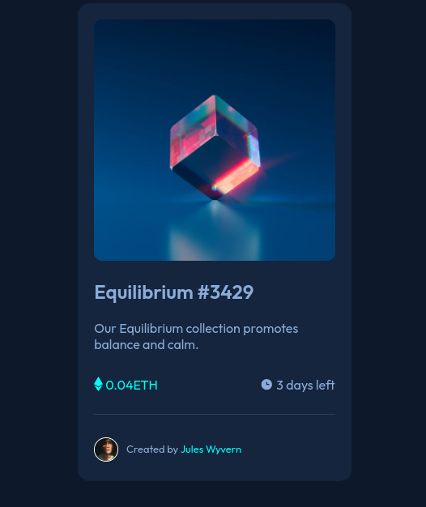

# NFT Card

## Love a bit of cryptocurrency? This project is a nft card for a cyptocurrecy (Ethereum)

- [Overview](#overview)
  - [Screenshot](#screenshot)
  - [Links](#links)
- [My process](#my-process)
  - [Built with](#built-with)
  - [What I learned](#what-i-learned)
  - [Continued development](#continued-development)
  - [Useful resources](#useful-resources)
- [Author](#author)
- [Acknowledgments](#acknowledgments)

## Overview
Love a bit of cryptocurrency? This project is a nft card for a cyptocurrecy (Ethereum)

## Screenshot

## My process
Before approaching this project I made the mistake of trying to do it as I did with others. But after encountering issues with certain aspects, I came across a Kevin Powell video and I approached this task with some of the tips he gave (Not that this entirely made it effortless) but it added more clarity
and as a result I was able to write HTML(less classes) and CSS (less styles) to the code and achieve beter results

## Built With
* Semantic HTML Markup
* CSS 

## What I learned
Making the image opaque and with a color on it was a headache, spent a few days trying to figure how that works.
However, to some degree I was able to make it work

## Continued development
Further designs will be aimed at:
* Making the card responsive
* Making sure the images are properly displayed (when hovered on) and others become opaque

## Author
* [kingHorey](https://www.frontendmentor.io/profile/kinghorey) on FrontendMentor
* [kingHorey](https://www.twitter.com/kinghorey) on Twitter

